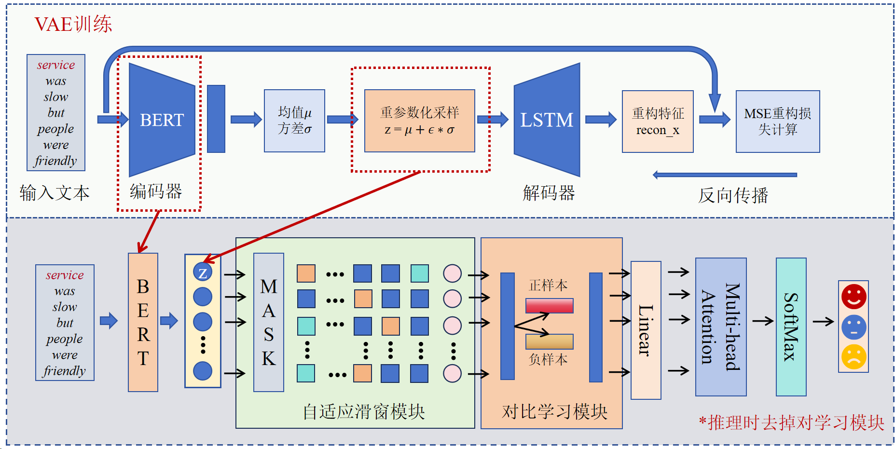

# AdaptWin: 方面级情感分析框架

本项目实现了 **AdaptWin** 模型，用于多方面级情感分析任务。目前该模型正在投递**《基于自适应滑窗和变分自编码器的方面级情感分析》**这篇论文。该模型通过 **VAE 增强架构** 提取潜在特征，并结合自适应窗口机制捕捉局部与全局的上下文信息。



## 目录
- [功能特色](#功能特色)
- [环境要求](#环境要求)
- [安装说明](#安装说明)
- [数据集](#数据集)
- [模型训练](#模型训练)
- [模型评估](#模型评估)
- [配置文件](#配置文件)
- [文件说明](#文件说明)
- [致谢](#致谢)

---

## 功能特色

- **VAE 模块**：集成变分自编码器（Variational Autoencoder），用于特征提取和正则化。
- **自适应窗口机制**：根据特定位置动态调整上下文注意力范围。
- **BERT 集成**：利用预训练 BERT 提供稳健的嵌入特征。
- **训练过程灵活可控**：支持早停机制、多种优化器和权重初始化方法。

---

## 环境要求

- Python >= 3.8
- PyTorch >= 1.10
- transformers >= 4.0
- scikit-learn >= 0.24
- numpy >= 1.20
- yaml >= 5.4

---

## 安装说明

1. 克隆本仓库：
   ```bash
   git clone https://github.com/your-repo/adaptwin.git
   cd adaptwin
   ```

2. 安装依赖项：
   ```bash
   pip install -r requirements.txt
   ```

---

## 数据集

本项目支持以下数据集：
- Twitter 情感数据集
- Semeval 2014 餐厅和笔记本情感数据集

在 `config.yaml` 文件中指定数据集路径：
```yaml
dataset: "twitter"
dataset_file:
  train: "./datasets/twitter/train.raw"
  test: "./datasets/twitter/test.raw"
```

---

## 模型训练

### 训练 VAE 模块
在 `config.yaml` 文件中设置 `vae_epochs` 参数，以控制 VAE 训练的轮数。例如：
```yaml
vae_epochs: 10
```
直接运行 `main.py` 文件即可开始模型训练。

### 训练分类器
在完成 VAE 模块训练后，可以调整 `num_epoch` 参数以控制分类器训练的轮数，例如：
```yaml
num_epoch: 30
```
然后再次运行 `main.py` 文件，开始分类器训练。

---

## 模型评估

在 `config.yaml` 中确保设置好测试集路径，并直接运行 `main.py` 进行模型的评估，或在训练结束后自动评估。

评估指标包括：
- 准确率（Accuracy）
- 宏平均 F1 分数（Macro F1-score）

---

## 配置文件

所有训练和模型的相关配置存储在 `config.yaml` 文件中。以下是关键选项的说明：

### 通用配置
- `model_name`：指定使用的模型，目前支持 `AdaptWin_bert`。
- `dataset`：指定使用的数据集，可选项包括 `twitter`、`restaurant` 和 `laptop`。
- `pretrained_bert_name`：预训练 BERT 模型的名称，例如 `bert-base-uncased`。
- `device`：指定计算设备，例如 `cuda:0`（GPU）或 `cpu`。

### 训练参数
- `optimizer`：优化器类型，例如 `adam`、`sgd`。
- `initializer`：权重初始化方法，例如 `xavier_uniform_`。
- `lr`：学习率，推荐值为 `5e-5` 或 `2e-5`（BERT 模型）；`1e-3`（非 BERT 模型）。
- `dropout`：Dropout 比例，用于防止过拟合。
- `l2reg`：L2 正则化系数。
- `num_epoch`：训练迭代的轮数。
- `batch_size`：训练的批量大小，建议使用 `16`、`32` 或 `64`（BERT 模型）。
- `log_step`：每 `log_step` 批打印训练日志。
- `early_stop`：是否启用早停机制。
- `patience`：在早停机制中，等待改进的最大轮数。

### VAE 模块参数
- `vae_epochs`：VAE 模块训练的轮数。
- `vae_lr`：VAE 模块的学习率。
- `latent_dim`：VAE 潜变量的维度。
- `beta`：VAE 损失中 KL 散度项的权重。

### 数据集参数
- `max_seq_len`：BERT 分词器的最大序列长度。
- `valset_ratio`：训练集中用于验证的比例（例如，`0` 表示不划分验证集）。
- `polarities_dim`：分类任务的类别数。

### 示例配置
以下是 `config.yaml` 文件的示例：
```yaml
model_name: AdaptWin_bert
dataset: twitter
optimizer: adam
initializer: xavier_uniform_
lr: 0.00002
dropout: 0.1
l2reg: 0.00001
num_epoch: 30
batch_size: 32
log_step: 10
embed_dim: 300
hidden_dim: 300
bert_dim: 768
pretrained_bert_name: bert-base-uncased
max_seq_len: 100
polarities_dim: 3
patience: 5
device: cuda:0
seed: 2123
valset_ratio: 0
threshold: 10
early_stop: False
vae_epochs: 10
vae_lr: 0.001
latent_dim: 128
beta: 0.5
```

---

## 文件说明

- **`main.py`**：项目的主入口文件，负责训练和评估。
- **`models/emofuse.py`**：AdaptWin 模型的实现，包括 VAE 和自适应注意力机制。
- **`dataset.py`**：数据预处理和自定义数据集类。
- **`config.yaml`**：配置文件，包含模型和训练的所有参数。
- **`requirements.txt`**：所需 Python 包的列表。

---

## 致谢

本项目使用了 [HuggingFace Transformers](https://huggingface.co/transformers/) 和 BERT 预训练模型，并基于 PyTorch 实现。同时在dataloader的分布参考了[ABSA-Pytorch](https://github.com/songyouwei/ABSA-PyTorch])的写法。